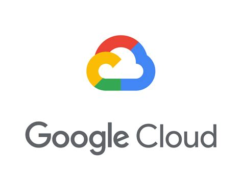
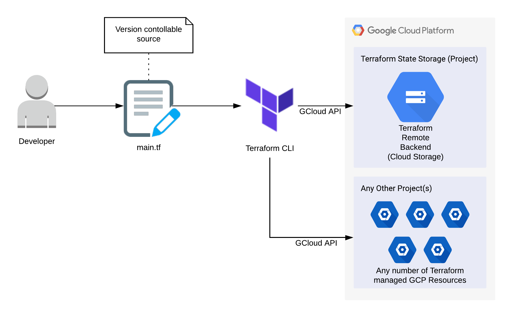

# Terraform GCP Storage Bucket with Remote Backend

Cloud Infrastructure as Code: Provisioning a GCP Storage Bucket using a Terraform Remote Backend.

## Features

<p align="center"><a href="https://cloud.google.com/"></a><a href="https://www.terraform.io/"></a></p>

 - This project builds upon the [infrastructure-terraform-gcp-intro](https://github.com/inventive-technology/infrastructure-terraform-gcp-intro) and [infrastructure-terraform-gcp-remote-backend](https://github.com/inventive-technology/infrastructure-terraform-gcp-remote-backend) projects to provision a simple resource (a storage bucket) in Google Cloud Platform, as well as persisting Terraform state information to a remote backend in a separate GCP project.

 - See [infrastructure-terraform-gcp-remote-backend](https://github.com/inventive-technology/infrastructure-terraform-gcp-remote-backend) for a full description.

<p align="center"></p>

## Prerequisites

 - An installation of [Terraform CLI](https://learn.hashicorp.com/tutorials/terraform/install-cli)
 - A Google Cloud Platform account and installation of [Google Cloud SDK](https://cloud.google.com/sdk/docs/install)
 - A deployment of [infrastructure-terraform-gcp-remote-backend](https://github.com/inventive-technology/infrastructure-terraform-gcp-remote-backend), which provides the following required by this project:
    - A GCP project ID for the remote backend.
    - A storage bucket name for the remote backend.
    - A json key for a service account with Editor priviledge on the remote backend project.

## Getting Started

 - Log into Google Cloud Platform create a new project and *copy* the project ID. This project will be separate from the project that provides the remote backend.
 
 - Edit the [main.tf](main.tf) and *paste* your project ID into the **project** line:

```
  project     = "place-project-id-here"
```

 - Within your GCP account for the selected project, under *IAM & Admin* find the *Service Accounts* section and create a GCP service account with the "Editor" priviledge. Export a json key for the service account and save it in the 'keys' sub-directory. See the [infrastructure-terraform-gcp-intro](https://github.com/inventive-technology/infrastructure-terraform-gcp-intro) project for detailed instructions.
 
 - Edit the [main.tf](main.tf) file and insert the file name of the exported json file into the **credentials** line, for example:

```
  credentials = file("keys/my-project-key.json")
```

 - Edit the [main.tf](main.tf) file and configure the remote backend:
     - The *bucket* name must match the name of the remote backend bucket created in the [infrastructure-terraform-gcp-remote-backend](https://github.com/inventive-technology/infrastructure-terraform-gcp-remote-backend) project.
     - The *credentials* must reference the service account json key for the terraform-state-storage project. Save this in the 'keys' sub-directory.
     - Setting *prefix* to the name of *this* project will provide a distinct sub-directory within the Terraform remote backend in which Terraform can store all state information.
 
```
terraform {
  backend "gcs" {
    bucket      = "terraform-remote-backend-xxxxxxxxxxxxxxxx"
    prefix      = "storage"
    credentials = "keys/terraform-state-storage-xxxxxx-xxxxxxxxxxxx.json"
  }
}
```

 - At the command line, in the root of this project you will need to initialise Terraform:

```
terraform init
```

 - You can then validate that the syntax of the Terraform configuration is correct by running:

```
terraform validate
```

 - To see what changes Terraform will need to apply, run:

```
terraform plan
```
 - Now we are ready to deploy the infrastructure, you will need to confirm with 'yes' when prompted:

```
terraform apply
```
 - The storage bucket should now exist within your GCP project. Additionally, the Terraform state will have been persisted to the remote backend in the terraform-state-storage GCP project.

## Usage

```bash
terraform init
terraform validate
terraform plan
terraform apply
terraform destroy
```

## Contributing
If you have any feedback/ideas open an issue and tell me what you think.

## References/Related Projects
 - [https://terraform.io](https://terraform.io)
 - [https://cloud.google.com](https://cloud.google.com)
 - [https://github.com/inventive-technology/infrastructure-terraform-gcp-intro](https://github.com/inventive-technology/infrastructure-terraform-gcp-intro) - a basic introduction to Terraform/GCP
 - [https://github.com/inventive-technology/infrastructure-terraform-gcp-remote-backend](https://github.com/inventive-technology/infrastructure-terraform-gcp-remote-backend) - a prerequisite of *this* project